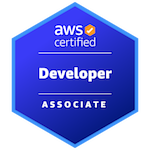

### 🔍 Open to work
I'm a full stack developer with a strong interest in backend systems, cloud architecture, and solving real-world problems through code.  
Currently focused on Go, .NET Core, and expanding my cloud knowledge.

---

### 🛠 Tech I use:
- TypeScript / React
- Go / .NET Core
- PostgreSQL / SQLite
- AWS

---

<table>
  <tr>
    <th>🎓 Certifications</th>
    <th>🌐 Connect with me</th>
  </tr>
    <tr align="center">
      <td>
      
      </td>
      <td>
     
         
      
      </td>
    <tr>
    </td>
  </tr>
</table>

<!--
**LB-developer/LB-developer** is a ✨ _special_ ✨ repository because its `README.md` (this file) appears on your GitHub profile.

Here are some ideas to get you started:

- 🔭 I’m currently working on ...
- 🌱 I’m currently learning ...
- 👯 I’m looking to collaborate on ...
- 🤔 I’m looking for help with ...
- 💬 Ask me about ...
- 📫 How to reach me: ...
- 😄 Pronouns: ...
- ⚡ Fun fact: ...
-->
